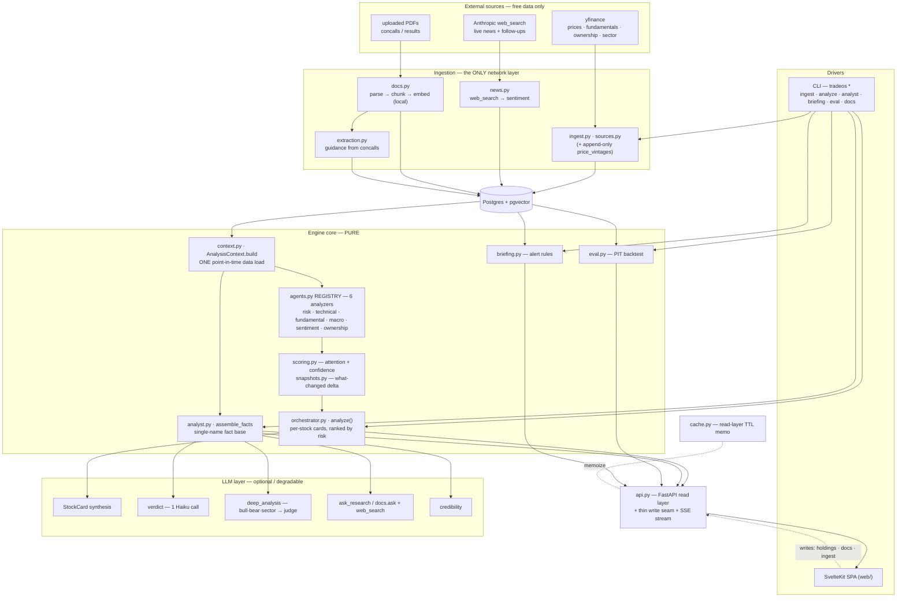
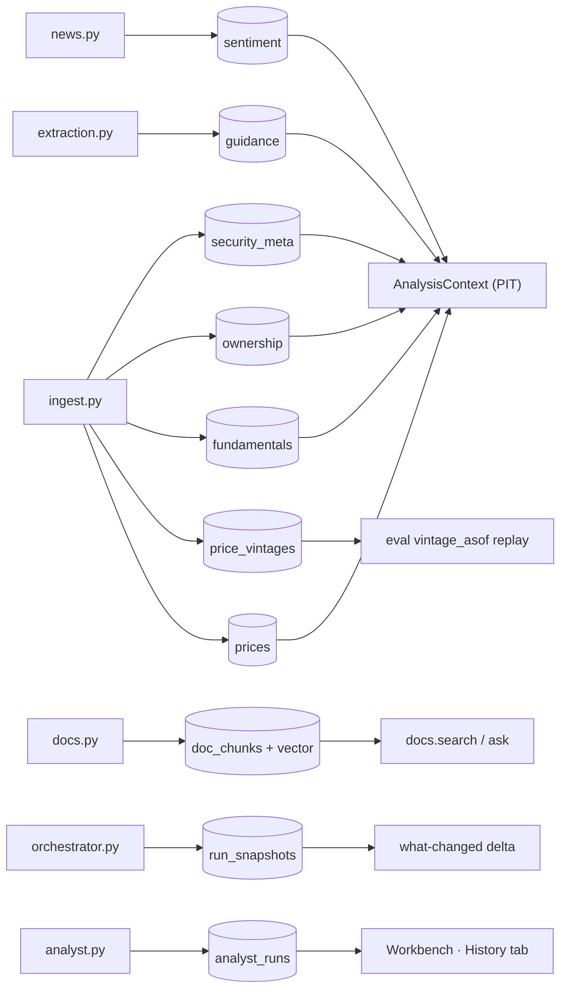
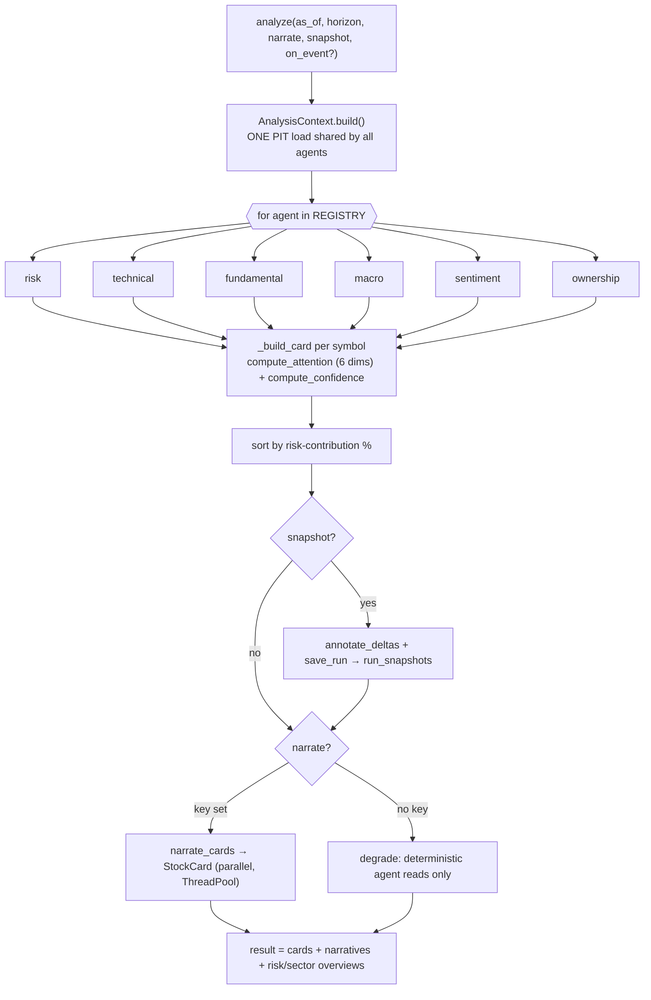
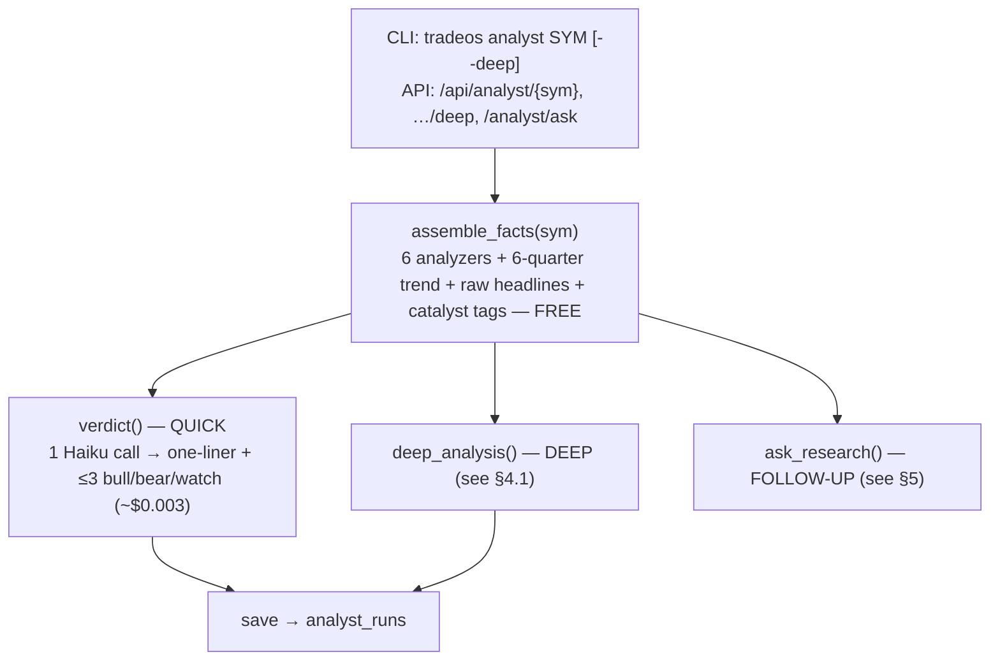
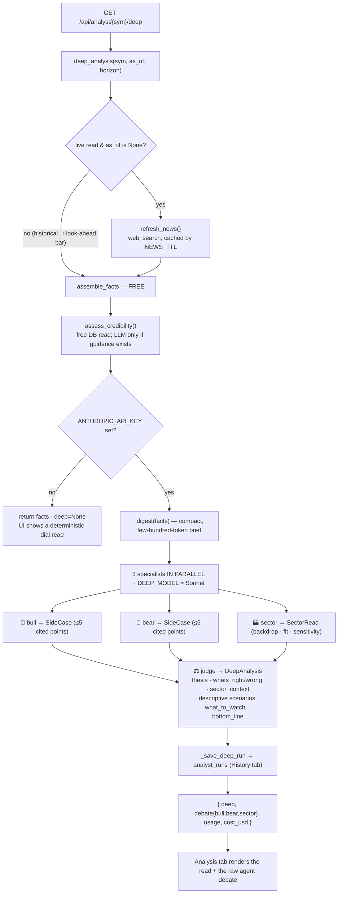
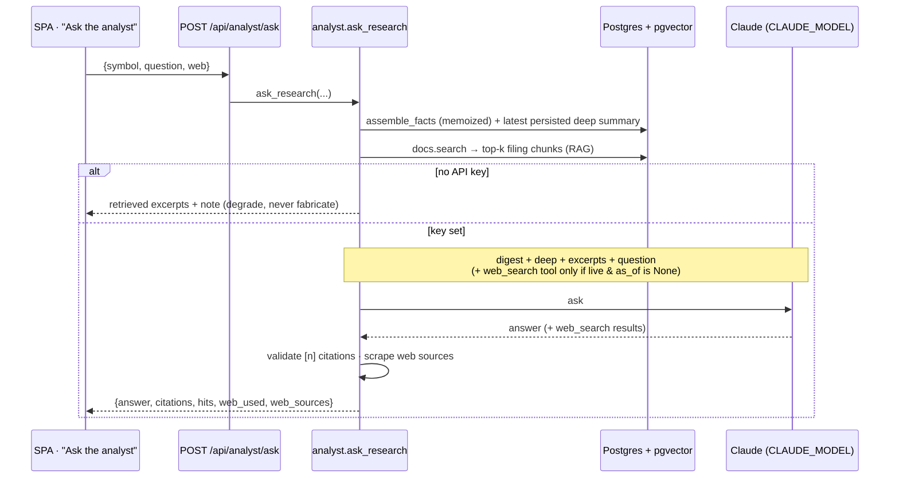
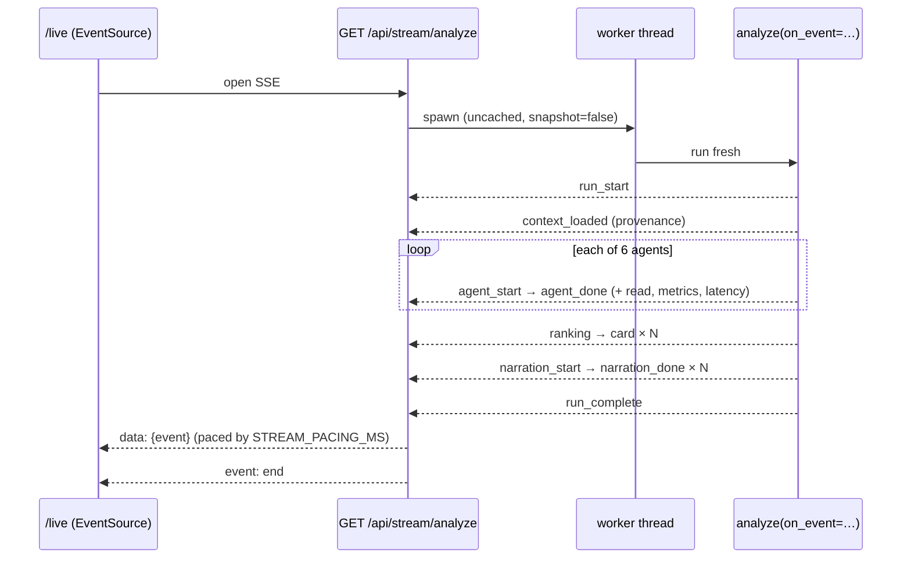
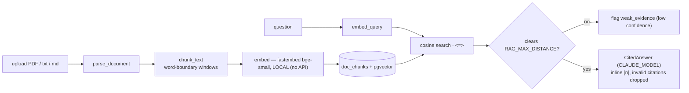
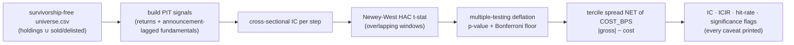

# TradeOS — how the flow works

A scheduled, multi-agent **equity-analysis** system on a real portfolio. It is **descriptive, never
prescriptive** (explains risk/technicals/fundamentals; never says buy/sell/hold — SEBI), every number
is **point-in-time and reproducible**, and the **LLM layer is optional** (everything factual works with
no API key).

These diagrams render on GitHub and in any Mermaid-aware Markdown viewer.

**The three layers, and the rule that separates them:**
| Layer | Modules | Network? | LLM? | Determinism |
|---|---|---|---|---|
| **Ingestion** | `ingest.py` `sources.py` `news.py` `docs.py` `extraction.py` | ✅ the *only* network layer | only `news`/web-search | side-effectful |
| **Engine core** | `context.py` `agents.py` `risk/technical/fundamental/macro/sentiment/ownership` `scoring.py` `snapshots.py` `orchestrator.py` `analyst.py` `eval.py` `briefing.py` | ❌ never | ❌ never computes | **pure** (no `datetime.now()`, no hidden state) |
| **LLM narration** | `StockCard` synth · `verdict` · `deep_analysis` · `ask_research` · `credibility` · `docs.ask` | via Anthropic | ✅ | optional / degradable |

The **API/SPA are READ layers** — no quant logic, no per-agent DB queries; they just serve the engine's reads.

---

## 1 · System overview

---

## 2 · Data layer (who writes, who reads)

All reads are **point-in-time**: only data with availability `<= as_of` is used (fundamentals apply an
announcement lag; ownership/sentiment are PIT-gated on their snapshot date; price vintages reconstruct
"as known at" a date for reproducible backtests).

---

## 3 · Portfolio analysis pipeline — `orchestrator.analyze()`

> `on_event` is an **optional observer** (default `None` ⇒ byte-identical run). When wired, it emits every
> stage to the live Reasoning Monitor — it only *watches*, it never changes a number. (See §6.)

---

## 4 · Single-name analyst — `analyst.py`

`assemble_facts` is the **free, deterministic** base. On top of it sit three optional LLM reads of
increasing depth, all descriptive and all degradable.

### 4.1 · `deep_analysis` — the multi-agent read (bull · bear · sector → judge)

Every prompt carries the bright-line clause: **descriptive only, no buy/sell/targets, cite a provided
number, never invent one.** "How it should perform" is rendered as **conditional scenarios**
("IF x and y, THEN the setup descriptively implies z") — never a prediction. The sector agent is told it
has **no live sector-index/peer feed**, so it labels sector views as context, not data.

---

## 5 · Ask the analyst — `ask_research` (whole research + live web)

Distinct from the Documents-tab "Ask the filings" (`docs.ask`, which sees **only** ingested filings).

---

## 6 · Live Reasoning Monitor — `/live` over SSE

---

## 7 · RAG document intelligence — `docs.py`

Retrieval is fully offline (local embeddings + pgvector); only the final synthesis needs a key, and it
**cites or refuses** — never invents.

---

## 8 · Honest signal evaluation — `eval.py`

> A signal has **no edge until proven** out-of-sample, net of costs. Current honest caveat: the
> cross-section is small/underpowered and the universe lacks genuinely delisted names — the machinery is
> right; breadth is the binding constraint.

---

## 9 · Request → screen map (the SPA)

| Screen (route) | Primary endpoint(s) | Shows |
|---|---|---|
| Overview `/` | `GET /api/portfolio` `GET /api/risk` | KPI tiles · risk-vs-weight bars · sector donut · correlation heatmap · cards |
| Briefing `/briefing` | `GET /api/briefing` | alert-rule flags; each name links to the Workbench |
| **Analyst Workbench** `/analyst/[symbol]` | `GET /api/analyst/{sym}` · `…/deep` · `POST /api/analyst/ask` · `…/series` · `…/news` · `…/docs` · `…/history` | every fetched detail; **Analysis** tab = the deep read + agent debate + **Ask the analyst**; Documents = **Ask the filings** |
| Reasoning Monitor `/live` | `GET /api/stream/analyze` (SSE) | the 6 agents running live + streamed synthesis |
| Newsroom `/news` | `GET /api/news` | all fetched headlines, filterable |
| Coverage `/coverage` | `GET /api/coverage` | per-name data presence + freshness (blind-spot map) |
| Manage `/manage` | `POST /api/holdings` · `DELETE …` · `POST /api/docs` · `POST /api/ingest` | the thin write seam (each calls the same fn the CLI uses, then clears the cache) |

---

## 10 · The guardrails the whole flow obeys

1. **Descriptive, never prescriptive** — no buy/sell/hold, no price targets (SEBI). Enforced in every prompt.
2. **Point-in-time integrity** — only data `<= as_of`; live web/news fire **only for a live read** (`as_of is None`).
3. **Determinism** — the quant core is pure (no network, no clock, no hidden state). Ingestion is the only network layer; LLM narration is separate and optional.
4. **Provenance & honest gaps** — every number traces to its inputs + `as_of`; missing data ⇒ `None` / "no data" / low confidence, never fabricated. RAG answers cite or refuse.
5. **Costs aren't optional in eval**; **no edge until proven** out-of-sample.

---

### Model knobs (env)
- `CLAUDE_MODEL` — the strong model for synthesis · `docs.ask` · `ask_research` (default `claude-opus-4-8`).
- `DEEP_MODEL` — the deep multi-agent read (default `claude-sonnet-4-6`).
- `ANALYST_MODEL` — the cheap quick `verdict` + credibility (default `claude-haiku-4-5`).
- `NEWS_MODEL` — live news web-search (default `claude-haiku-4-5`).
